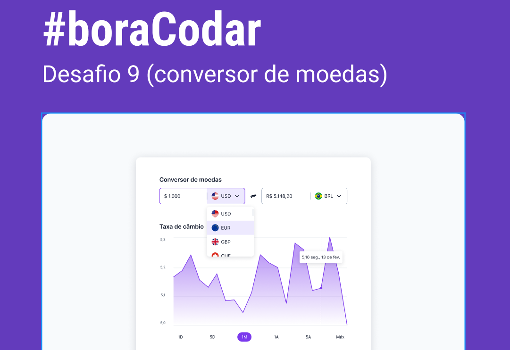

<h1 align="center">Currency translate</h1>
<p align="center">
  
  
  
</p>
<p align="center">
    
</p>


<br>
<br>

## 🧪 Technologies

This project was developed using the following technologies:

- [CSS](https://developer.mozilla.org/pt-BR/docs/Web/CSS)
- [Html](https://developer.mozilla.org/pt-BR/docs/Web/HTML)
- [Grid](https://www.origamid.com/projetos/css-grid-layout-guia-completo/)
- [Flex](https://origamid.com/projetos/flexbox-guia-completo/)
- [Figma](https://www.figma.com/)
- [PhosporIcons](https://phosphoricons.com/)


## 🚀 Getting started
Clone the project and access the folder.

```bash
$ https://github.com/weslleyolli/Currency-translation
$ cd Dasboard-rocketseat
```

Follow the steps below:

### Web

```bash

$ Open index.html
```

## 🔖 Layout

You can view the project layout through the links below:

- [Layout](<https://www.figma.com/file/i937umRzYcV5XN61s1aCQS/%23boraCodar---Desafio-9-(Community)?node-id=1%3A5&t=M5PiP7JWkernZcmN-0>)

Remembering that you need to have a [Figma](http://figma.com/) account to access it.

---

Made with 💜 by [Weslleyolli](https://github.com/weslleyolli)👋